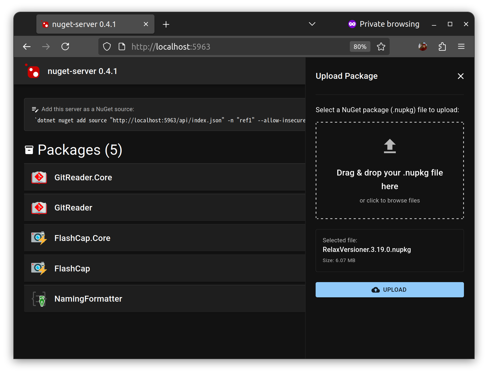
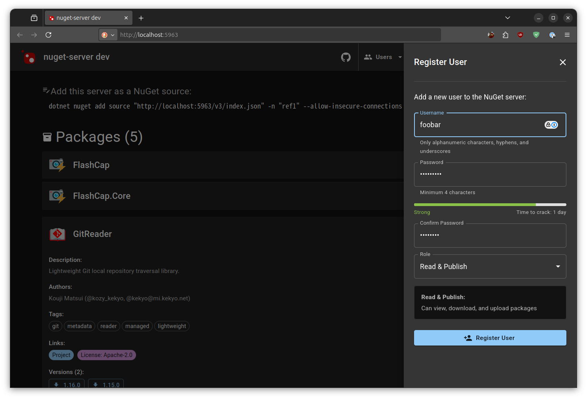
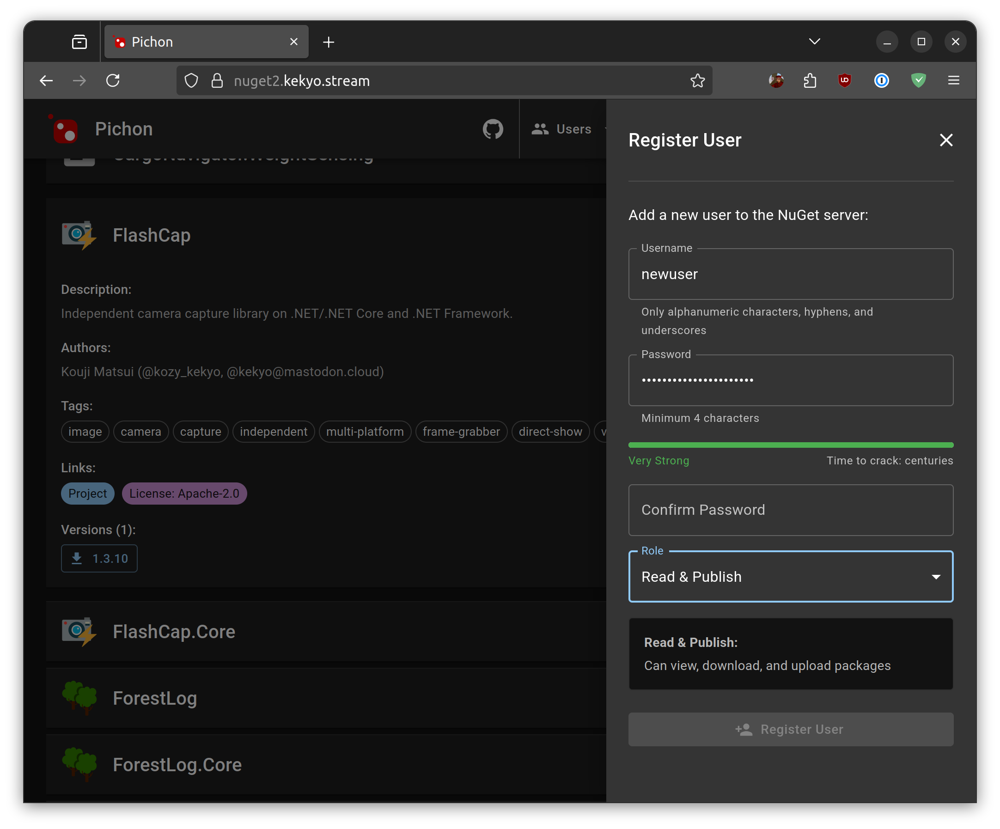
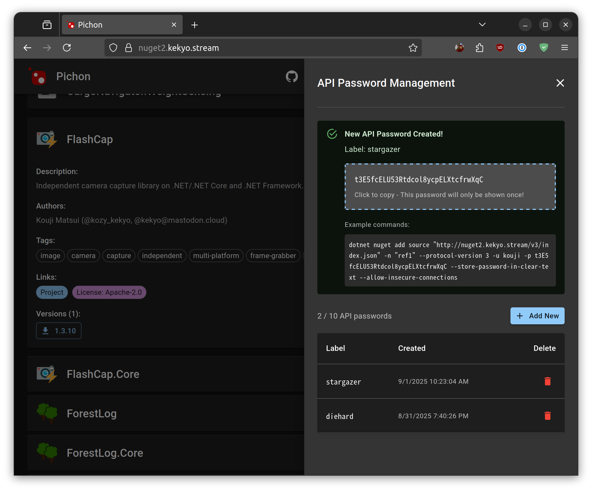

# nuget-server

シンプルでモダンなNuGetサーバー実装


[](https://www.repostatus.org/#active)
[](https://opensource.org/licenses/MIT)
[](https://www.npmjs.com/package/nuget-server)
[](https://hub.docker.com/r/kekyo/nuget-server)

---

[(English is here)](./README.md)

## これは何？

Node.js上に構築された、NuGet V3 APIエンドポイントを提供するシンプルなNuGetサーバー実装です。

パッケージの公開、クエリ、手動ダウンロード、`dotnet restore`および標準的なNuGetクライアントと互換性があります。

モダンなブラウザベースのUIも提供されています：

- 登録されたパッケージを参照できます。さまざまなパッケージ属性を確認できます。
- バージョン別にパッケージをダウンロードできます。
- パッケージの公開（アップロード）も可能です。
- ユーザーアカウントを管理できます。

**パッケージリストの閲覧：**


**パッケージの公開：**



**ユーザーアカウント管理：**



### 主な機能

- **簡単セットアップ、10秒でNuGetサーバーを起動！**
- NuGet V3 API互換性：最新のNuGetクライアント操作をサポート
- データベース管理不要：パッケージファイルとnuspecをファイルシステムに直接保存、データベース管理から解放
- パッケージ公開：cURLやその他のツールで`HTTP POST`を使用して`.nupkg`ファイルを柔軟にアップロード
- 基本認証：必要に応じて公開と一般アクセス用の認証を設定
- リバースプロキシサポート：適切なURL解決のための信頼できるリバースプロキシ処理を設定可能
- 拡張機能を備えたモダンなWeb UI：
  - 複数パッケージアップロード：複数の.nupkgファイルを一度にドラッグ＆ドロップ
  - ユーザーアカウント管理：ユーザーの追加/削除、パスワードリセット（管理者のみ）
  - APIパスワード再生成：セルフサービスでAPIパスワードを更新
  - パスワード変更：ユーザーは自分のパスワードを変更可能
- パッケージインポーター：既存のNuGetサーバーからのパッケージインポーター付属
- Dockerイメージ利用可能

## 動作環境

Node.js 20.18.0以降

使用スタック: Node.js, Typescript, Vite, Vitest, prettier-max, screw-up, Fastify, Passport, zxcvbn, React, React MUI, react-infinite-scroll, notistack, typed-message, dayjs, commander, adm-zip, xml2js

すべてをTypescript環境で実装することで、開発環境と開発サイクルをシンプルに保っています。

---

## インストール

```bash
npm install -g nuget-server
```

Dockerイメージを使う場合は、別章を参照してください。

## 使用方法

```bash
# デフォルトポート5963でサーバーを起動
nuget-server

# カスタムポート
nuget-server --port 3000

# 複数のオプション
nuget-server --port 3000 -users-file config/users.json --max-upload-size-mb 500
```

NuGet V3 APIは `/v3` パスで提供されます。

- デフォルトのnuget-server提供URL（UIを表示）：`http://localhost:5963`
- 実際のNuGet V3 APIエンドポイント：`http://localhost:5963/v3/index.json`

デフォルトのnuget-server提供URLは `--base-url` オプションで変更できます。
これは特に、リバースプロキシを使用してエンドポイントを公開する場合に必要になります。詳細は別章を参照してください。

## NuGetクライアントの設定

nuget-serverはNuGet V3 APIのみサポートしています。従って、NuGetクライアントからは常にV3 APIでアクセスする必要があります。
明示的にV3 APIを使用するように指定しない場合は、V3 APIにフォールバックする実装としない実装があるため、必ず指定してください。以下に例を示します。

パッケージソースとして追加：

**HTTPエンドポイントの場合：**

```bash
dotnet nuget add source http://localhost:5963/v3/index.json \
  -n "local" --protocol-version 3 --allow-insecure-connections
```

**HTTPSエンドポイントの場合：**

```bash
dotnet nuget add source https://packages.example.com/v3/index.json \
  -n "packages" --protocol-version 3
```

または `nuget.config` で指定：

```xml
<?xml version="1.0" encoding="utf-8"?>
<configuration>
  <packageSources>
    <add key="local" value="http://localhost:5963/v3/index.json"
      protocolVersion="3" allowInsecureConnections="true" />
  </packageSources>
</configuration>
```

### パッケージの公開

`HTTP POST` メソッドを使用して、cURLまたは任意のHTTPクライアントで `/api/publish` エンドポイントにパッケージをアップロードします：

```bash
# "MyPackage.1.0.0.nupkg" ファイルをアップロード
curl -X POST http://localhost:5963/api/publish \
  --data-binary @MyPackage.1.0.0.nupkg \
  -H "Content-Type: application/octet-stream"
```

あなたはこの方法で公開することに不満があるかも知れません。dotnetコマンドには、`dotnet nuget push`があり、これが標準的な方法です。
しかし、私の経験では、このプロトコルは`multipart/form-data`を使用して送信しており、これがゲートウェイサービス・リバースプロキシ・ロードバランサーなどで不具合を起こすことがありました。
そのため、今のnuget-serverはこの方法を実装せず、最も単純なバイナリ送信手順を使用することにしました。

この方法には他にも、認証を有効にした場合に、Basic認証とAPI keyを別個に管理しなくても良いという利点があります。
これも、読み取り操作とパッケージ発行を同一のキーで管理する事に問題を感じるかも知れませんが、その場合はユーザーを分ければよいのです。

認証については、別章を参照してください。

---

## パッケージストレージの設定

### ストレージの場所

デフォルトでは、パッケージはnuget-serverを実行するディレクトリの `packages/` に保存されます。
`--package-dir` オプションを使用してこの場所をカスタマイズできます：

```bash
# デフォルトの ./packages ディレクトリを使用
nuget-server

# カスタムディレクトリを使用（相対パスまたは絶対パス）
nuget-server --package-dir /another/package/location
```

### パッケージストレージのレイアウト

パッケージは次の構造でファイルシステムに保存されます：

```
packages/
├── PackageName/
│   ├── 1.0.0/
│   │   ├── PackageName.1.0.0.nupkg
│   │   ├── PackageName.nuspec
│   │   └── icon.png            # パッケージアイコン（存在する場合）
│   └── 2.0.0/
│       ├── PackageName.2.0.0.nupkg
│       ├── PackageName.nuspec
│       └── icon.jpg            # パッケージアイコン（存在する場合）
└── AnotherPackage/
    └── 1.5.0/
        ├── AnotherPackage.1.5.0.nupkg
        ├── AnotherPackage.nuspec
        └── icon.png            # パッケージアイコン（存在する場合）
```

### バックアップとリストア

単純に `tar` や他のアーカイバを使用してパッケージディレクトリをバックアップできます：

```bash
cd /your/server/base/dir
tar -cf - ./packages | lz4 > backup-packages.tar.lz4
```

リストアは単純に展開して、同じパッケージディレクトリ設定でnuget-serverを再実行するだけです。なぜなら、nuget-serverはデータベースのような特殊なストレージを一切使用しないからです。

---

## 設定

nuget-serverは、コマンドラインオプション・環境変数・JSONファイルを通じた設定をサポートしています。

設定は次の順序で適用されます（優先度が高い順）：

1. コマンドラインオプション
2. 環境変数
3. `config.json`
4. デフォルト値

## 設定ファイルの構造

カスタム設定ファイルを指定できます：

```bash
# コマンドラインオプションを使用
nuget-server --config-file /path/to/config.json
# または短縮エイリアス
nuget-server -c /path/to/config.json

# 環境変数を使用
export NUGET_SERVER_CONFIG_FILE=/path/to/config.json
nuget-server
```

指定されない場合、nuget-serverは現在のディレクトリで `./config.json` を探します。

### config.jsonの構造

`config.json` ファイルを作成：

```json
{
  "port": 5963,
  "baseUrl": "http://localhost:5963",
  "packageDir": "./packages",
  "usersFile": "./users.json",
  "realm": "Awsome nuget-server",
  "logLevel": "info",
  "trustedProxies": ["127.0.0.1", "::1"],
  "authMode": "none",
  "sessionSecret": "<your-secret-here>",
  "passwordMinScore": 2,
  "passwordStrengthCheck": true,
  "maxUploadSizeMb": 100
}
```

すべてのフィールドはオプションです。上書きしたい設定のみを含めてください。
`packageDir` と `usersFile` のパスは絶対パスまたは相対パスにできます。相対パスの場合、`config.json`ファイルを含むディレクトリから解決されます。

---

## 認証機能

nuget-serverは認証もサポートしています。

| 認証モード | 詳細                           | 認証の初期化 |
| :--------- | :----------------------------- | :----------- |
| `none`     | デフォルト。認証を全く求めない | 不要         |
| `publish`  | パッケージ発行のみ認証が必要   | 必要         |
| `full`     | 常に認証が必要（ログイン必須） | 必要         |

nuget-serverで認証を有効化する場合は、最初に `--auth-init`オプションを使用して初期のユーザーを登録します。

### 初期化

初期管理者ユーザーを対話的に作成します：

```bash
nuget-server --auth-init
```

このコマンドは以下を実行します：

1. 管理者ユーザー名の入力を求める（デフォルト：`admin`）
2. パスワードの入力を求める（強度チェック付き、マスク入力）
3. `users.json` を作成
4. 初期化後に終了（サーバーは起動しない）

Docker imageを使用して認証を有効化する場合も、このオプションで初期のユーザーを生成してください。

### セッション例

```
Initializing authentication...
Enter admin username [admin]:
Enter password: ********
Confirm password: ********

============================================================
Admin user created successfully!
============================================================
Username: admin
Password: *********************
============================================================
```

### ユーザーの管理

`--auth-init`で追加したユーザーは自動的に管理者ユーザーとなります。
管理者ユーザーは、UIで他のユーザーの追加・削除を行うことが出来ます。また、ユーザーのパスワードリセットも可能です。



管理者ユーザーでも後述のAPIパスワードを割り当てることは出来ますが、できるだけユーザーを分けて管理することをお勧めします。

### APIパスワードの使用

nuget-serverは、UIにログインするパスワードと、NuGetクライアントがアクセス時に使用するパスワードを区別しています。
NuGetクライアントがアクセス時に使用するパスワードは「APIパスワード」と呼び、そのユーザーとAPIパスワードの組でアクセスします。

ブラウザでUIを表示してログインしてください。
UIのメニューから "API password" のメニューを選択して、APIパスワードを生成します。
このAPIパスワードを使用すれば、NuGetクライアントからアクセスが可能になります。



以下にAPIパスワードを使用する例を示します:

```bash
# APIパスワードでソースを追加
dotnet nuget add source http://localhost:5963/v3/index.json \
  -n "local" \
  -u admin \
  -p xxxxxxxxxxxxxxxxxxxxxx \
  --protocol-version 3 --store-password-in-clear-text --allow-insecure-connections
```

または認証情報付きの `nuget.config` を指定：

```xml
<?xml version="1.0" encoding="utf-8"?>
<configuration>
  <packageSources>
    <add key="local" value="http://localhost:5963/v3/index.json"
      protocolVersion="3" allowInsecureConnections="true" />
  </packageSources>
  <packageSourceCredentials>
    <local>
      <add key="Username" value="reader" />
      <add key="ClearTextPassword" value="xxxxxxxxxxxxxxxxxxxxxx" />
    </local>
  </packageSourceCredentials>
</configuration>
```

パッケージ公開用：

```bash
# APIパスワードでパッケージを公開
curl -X POST http://localhost:5963/api/publish \
  -u admin:xxxxxxxxxxxxxxxxxxxxxx \
  --data-binary @MyPackage.1.0.0.nupkg \
  -H "Content-Type: application/octet-stream"
```

パッケージ公開では、`Authorization` ヘッダにBasic認証を設定することで、パッケージを送信可能です。

### パスワード強度要件

nuget-serverは `zxcvbn` ライブラリを使用して強力なパスワード要件を強制します：

- 0-4のスケール（弱い〜非常に強い）でパスワード強度を評価
- デフォルト最小スコア：2（良い）
- 一般的なパスワード、辞書の単語、パターンをチェック
- パスワード作成中にリアルタイムフィードバックを提供

`config.json` でパスワード要件を設定：

```json
{
  "passwordMinScore": 2, // 0-4、デフォルト：2（良い）
  "passwordStrengthCheck": true // デフォルト：true
}
```

nuget-serverは、パスワードとAPIパスワードを両方ともSALT付きハッシュ化された情報として保持しているため、生パスワードが記録されることはありません。
しかし、HTTPSを使用しない場合は、 `Authorization` ヘッダに生パスワードが含まれるため、盗聴の危険性に注意してください。
エンドポイントを公開する場合は、HTTPSで通信を保護してください。

---

## 別のNuGetサーバーからパッケージをインポート

別のNuGetサーバーからローカルのnuget-serverインスタンスにすべてのパッケージをインポートします。
この機能は、NuGetサーバーをnuget-serverに移行する時に使用できます。

### パッケージインポートの初期化

CLIでパッケージを対話的にインポート：

```bash
nuget-server --import-packages --package-dir ./packages
```

このコマンドは以下を実行します：

1. ソースNuGetサーバーのURLの入力を求める
2. 認証が必要かどうかを尋ねる
3. 必要に応じて、ユーザー名とパスワードの入力を求める（マスク入力）
4. ソースサーバーからすべてのパッケージを検出
5. すべてのパッケージをローカルストレージにダウンロードしてインポート
6. 各パッケージの進行状況を表示（1%間隔）
7. インポート後に終了（サーバーは起動しない）

### インポートの動作

- 同じバージョンの既存パッケージは上書きされます
- 失敗したインポートはエラーの詳細とともにログに記録されます
- ログノイズを減らすため、進行状況は1%間隔で報告されます
- パッケージアイコンはインポート中に保持されます

並行ダウンロードは行いません。これはリポジトリに大量の要求を行わないようにするためです。

### セッション例

```
Starting package import...
Enter source NuGet server URL [http://host.example.com/repository/nuget/]: https://nexus.example.com/repository/nuget/
Does the server require authentication? [y/N]: y
Enter username: reader
Enter password: **********

============================================================
Import Configuration:
Source: https://nexus.example.com/repository/nuget/
Target: ./packages
Authentication: reader (password hidden)
============================================================

Start importing packages? (existing packages will be overwritten) [y/N]: y

Discovering packages from source server...
Found 125 packages with 563 versions total.
Starting package import...
Progress: 100/563 packages (17%) - MyPackage.Core@1.2.3
Progress: 563/563 packages (100%) - AnotherPackage@2.0.0

============================================================
Import Complete!
============================================================
Total packages: 125
Total versions: 563
Successfully imported: 563
Failed: 0
Time elapsed: 125.3 seconds
============================================================
```

---

## リバースプロキシとの相互運用性

サーバーはリバースプロキシの背後での実行をサポートしています。
例えば、`https://nuget.example.com` という公開URLがあり、ゲートウェイを経由して内部ネットワークのホストでnuget-serverを動作させるような場合です。

このような場合は、NuGet V3 APIから正しいサブエンドポイントアドレスを提供できるようにするために、公開URLのベースURLを指定する必要があります。

### URLの解決

サーバーは次の優先順位でURLを解決します：

1. 固定ベースURL（最高優先度）：`--base-url` オプションが指定されている場合、常に優先されます
2. 信頼できるプロキシヘッダー：`--trusted-proxies` で信頼できるプロキシが設定されている場合：
   - HTTP `Forwarded` ヘッダー（proto、host、port）
   - 従来の `X-Forwarded-*` ヘッダー（`X-Forwarded-Proto`、`X-Forwarded-Host`、`X-Forwarded-Port`）
3. 標準リクエスト情報（フォールバック）：プロキシヘッダーが利用できない場合は `Host` ヘッダーを使用

例えば `--base-url` オプション：

- nuget-serverが提供する公開ベースURL：`https://packages.example.com`
- 実際のNuGet V3 APIエンドポイント：`https://packages.example.com/v3/index.json`

```bash
# ベースURLを設定（/v3パスを含めない）
nuget-server --base-url https://packages.example.com

# NuGetソースとして追加
dotnet nuget add source https://packages.example.com/v3/index.json \
  -n "packages" --protocol-version 3
```

別のオプションとして、信頼できるプロキシアドレスで設定できます：

```bash
# 適切なホストヘッダー処理のために信頼できるプロキシを設定
nuget-server --trusted-proxies "10.0.0.1,192.168.1.100"
```

環境変数もサポートされています：

```bash
export NUGET_SERVER_BASE_URL=https://packages.example.com
export NUGET_SERVER_TRUSTED_PROXIES=10.0.0.1,192.168.1.100
export NUGET_SERVER_CONFIG_FILE=/path/to/config.json
export NUGET_SERVER_USERS_FILE=/path/to/users.json
export NUGET_SERVER_SESSION_SECRET=your-secret-key-here
export NUGET_SERVER_MAX_UPLOAD_SIZE_MB=500
```

---

## Dockerの使用

Dockerイメージは複数のアーキテクチャで利用可能です：

- `linux/amd64` (x86_64)
- `linux/arm64` (aarch64)

イメージをプルする際、Dockerは自動的にプラットフォームに適したアーキテクチャを選択します。

### クイックスタート

次のような永続化のためのディレクトリを構成したとします（推奨）:

```
docker-instance/
├── data/
│   ├── config.json
│   └── user.json
└── packages/
    └── (パッケージ群)
```

次のようにして実行します:

```bash
# 最新バージョンをプルして実行
docker run -d -p 5963:5963 \
  -v $(pwd)/data:/data \
  -v $(pwd)/packages:/packages \
  kekyo/nuget-server:latest

# またはDocker Composeで
cat > docker-compose.yml << EOF
version: '3'
services:
  nuget-server:
    image: kekyo/nuget-server:latest
    ports:
      - "5963:5963"
    volumes:
      - ./data:/data
      - ./packages:/packages
    environment:
      - NUGET_SERVER_AUTH_MODE=publish
EOF

docker-compose up -d
```

NuGetサーバーは以下で利用可能になります：

- Web UI：`http://localhost:5963`
- NuGet V3 API：`http://localhost:5963/v3/index.json`

### パーミッション要件

Dockerコンテナはセキュリティのため `nugetserver` ユーザー（UID 1001）として実行されます。
マウントするディレクトリには、このユーザーがファイルを書き込めるよう適切なパーミッションを設定する必要があります。

**マウントディレクトリに適切なパーミッションを設定：**

```bash
# ディレクトリが存在しない場合は作成
mkdir -p ./data ./packages

# UID 1001（コンテナ内のnugetserverユーザー）に所有権を設定
sudo chown -R 1001:1001 ./data ./packages
```

**重要**: 適切なパーミッションが設定されていない場合、以下の操作で `500 Permission Denied` エラーが発生します：

- ユーザーアカウントの作成・更新
- パッケージの公開
- 設定ファイルの書き込み

### 基本的な使用方法

```bash
# デフォルト設定で実行（ポート5963、パッケージとデータはマウントされたボリュームに保存）
docker run -p 5963:5963 \
  -v $(pwd)/data:/data \
  -v $(pwd)/packages:/packages \
  kekyo/nuget-server:latest

# 認証付き（users.jsonは/dataに作成される）
docker run -p 5963:5963 \
  -v $(pwd)/data:/data \
  -v $(pwd)/packages:/packages \
  -e NUGET_SERVER_AUTH_MODE=publish \
  kekyo/nuget-server:latest
```

環境変数やコマンドラインオプションを使用しても設定を変更できますが、最も簡単に設定を行うには、`config.json`を使用するのが良いでしょう。

Docker imageにはマウントポイントが設定されているので、上記の例のように `/data` と `/packages` をマウントし、`/data/config.json`を配置することで、設定を柔軟に行うことが出来ます。以下に`config.json`の例を示します:

```json
{
  "port": 5963,
  "baseUrl": "http://localhost:5963",
  "realm": "Awsome nuget-server",
  "logLevel": "info",
  "authMode": "publish"
}
```

認証情報の初期化や、パッケージのインポートを行う場合は、`config.json`を構成した上で、Docker image起動前にCLIで操作してください:

```bash
# 認証情報の初期化
nuget-server -c ./data/config.json --auth-init
```

### ボリュームマウントと設定

- `/data`：`config.json`, `users.json`およびその他の永続データ用のデフォルトデータディレクトリ
- `/packages`：デフォルトのパッケージストレージディレクトリ（パッケージを永続化するためにマウント）

**デフォルトの動作**：Dockerイメージはデフォルトで `--users-file /data/users.json --package-dir /packages` で実行され、マウントされたディレクトリが使用されます。

**設定の優先順位**（優先度が高い順）：

1. カスタムコマンドライン引数（CMDを上書きする場合）
2. 環境変数（例：`NUGET_SERVER_PACKAGE_DIR`）
3. `config.json`ファイル（明示的に指定された場合）
4. Dockerfileのデフォルトコマンドライン引数

### systemdによる自動起動例

systemdでコンテナを自動起動する方法は、様々な手法が考えられます。以下はPodmanを使用してsystemdサービスを構成する単純な例です。
これは、Podmanにquadletが導入される前に使用していた単純なサービスユニットファイルです。
これを配置してsystemdに認識させることで、nuget-serverを自動的に起動させることが出来ます:

`/etc/systemd/system/container-nuget-server.service`:

```ini
# container-nuget-server.service

[Unit]
Description=Podman container-nuget-server.service
Documentation=man:podman-generate-systemd(1)
Wants=network-online.target
After=network-online.target
RequiresMountsFor=%t/containers

[Service]
Environment=PODMAN_SYSTEMD_UNIT=%n
Restart=always
RestartSec=30
TimeoutStopSec=70
ExecStart=/usr/bin/podman run \
        --cidfile=%t/%n.ctr-id \
        --cgroups=no-conmon \
        --rm \
        --sdnotify=conmon \
        --replace \
        -d \
        -p 5963:5963 \
        --name nuget_server \
        -v /export/data:/data -v /export/packages:/packages docker.io/kekyo/nuget-server:latest
ExecStop=/usr/bin/podman stop \
        --ignore -t 10 \
        --cidfile=%t/%n.ctr-id
ExecStopPost=/usr/bin/podman rm \
        -f \
        --ignore -t 10 \
        --cidfile=%t/%n.ctr-id
Type=notify
NotifyAccess=all

[Install]
WantedBy=default.target
```

---

## Dockerイメージのビルド (高度)

nuget-serverのDocker imageのビルドは、Podmanを使用しています。

### Podmanによるマルチプラットフォームビルド（推奨）

提供されているマルチプラットフォームビルドスクリプトを使用して、Podmanですべてのサポートされているアーキテクチャ用にビルド：

```bash
# すべてのプラットフォーム用にビルド（ローカルのみ、プッシュなし）
./build-docker-multiplatform.sh

# ビルドしてDocker Hubにプッシュ
./build-docker-multiplatform.sh --push

# 特定のプラットフォームのみビルド
./build-docker-multiplatform.sh --platforms linux/amd64,linux/arm64

# カスタムDocker Hubユーザー名でプッシュ
OCI_SERVER_USER=yourusername ./build-docker-multiplatform.sh --push

# 既存のマニフェストを検査
./build-docker-multiplatform.sh --inspect
```

**重要**：クロスプラットフォームビルドには、最初にQEMUエミュレーションを設定する必要があります：

```bash
# オプション1：QEMUコンテナを使用（推奨）
sudo podman run --rm --privileged docker.io/multiarch/qemu-user-static --reset -p yes

# オプション2：システムパッケージをインストール
# Ubuntu/Debian:
sudo apt-get update && sudo apt-get install -y qemu-user-static
# Fedora/RHEL:
sudo dnf install -y qemu-user-static

# QEMUが動作していることを確認：
podman run --rm --platform linux/arm64 alpine:latest uname -m
# 出力されるべき: aarch64
```

QEMUなしでは、ネイティブアーキテクチャ用にのみビルドできます。

---

## 備考

### テスト環境

- Ubuntu 24.04 x86-64
- Ubuntu 24.04 x86-64 (podman hosted container)
- Ubuntu 22.04 x86-64
- Ubuntu 24.04 arm64
- Ubuntu 24.04 arm64 (podman hosted container)
- Cloudflare tunnel serviced global IPv4/IPv6 endpoint
- Direct global IPv4 endpoint

### サポートされるNuGet V3 APIエンドポイント

サーバーはNuGet V3 APIプロトコルのサブセットを実装しています：

- サービスインデックス：`/v3/index.json`
- パッケージコンテンツ：`/v3/package/{id}/index.json`
- パッケージダウンロード：`/v3/package/{id}/{version}/{filename}`
- 登録インデックス：`/v3/registrations/{id}/index.json`

注意: Visual StudioはNuGetサーバーにアクセスする際に、NuGetのプロトコル仕様におけるサービスインデックスを正しく参照していません。
(試した限りでは、Rider及びdotnet CLIでのアクセスは問題ありません。)

そのため、サービスインデックスの内容は形式的なもので、サービスインデックスを参照しなくても固定パスで直接アクセス出来ます。

### 非対話モード（CI/CD）

`--auth-init`や`--import-packages`では、管理者によるインタラクティブ応答を前提としています。
そのため、これらを自動化しようとすると、うまく機能しないことがあります。

そのような場合は、環境変数を通じて認証情報を提供できます：

```bash
export NUGET_SERVER_ADMIN_USERNAME=admin
export NUGET_SERVER_ADMIN_PASSWORD=MySecurePassword123!
nuget-server --auth-init --config-file ./config.json
```

これにより、ユーザーの操作なしにCI/CDパイプラインで初期化が可能になります。

### セッションセキュリティ

特別な構成のために（あるいは、セッションを永続的にサポートするために）、セッションシークレットを固定することが出来ます。指定するシークレットは十分な長さを持つ値を指定してください：

```bash
export NUGET_SERVER_SESSION_SECRET=$(openssl rand -base64 32)
nuget-server
```

（または `config.json` を使用。）

設定されていない場合、ランダムなシークレットが生成されます（警告がログに記録されます）。

### 存在しないパッケージIDの要求に対する応答

nuget-serverは、NuGet V3 API要求で存在しないパッケージIDを要求された場合、
既定では空のパッケージリストを返すことで応答します（エンドポイント: `/v3/package/{id}/index.json`）。
これは、NuGet V3 APIの仕様に違反しています: [PackageBaseAddress/3.0.0 response](https://learn.microsoft.com/en-us/nuget/api/package-base-address-resource#response)

この動作は、NuGetクライアントが、マルチパッケージソースを構成している時に、そのどれかのパッケージソースが404などのエラーを返した場合、他のパッケージソースの結果を待たずにエラーとする、奇妙な実装を回避するためです。詳しくは以下の議論を参照して下さい:

https://github.com/NuGet/Home/issues/6373

私はユーザーがこの動作に悩まされることを防ぐため（私も大いに悩んだ）、あえてV3 APIの仕様に違反した応答を行うように修正を加えました。もし、V3 APIに完全に準拠した応答（つまり、404エラーを返す）が必要であれば、`missingPackageResponse` 設定を `not-found` とすることで、対応できます。

```json
{
  "missingPackageResponse": "not-found" // デフォルトは "empty-array"
}
```

あるいは、CLIオプション `--missing-package-response <mode>` や 環境変数 `NUGET_SERVER_MISSING_PACKAGE_RESPONSE` も使用できます。

### 設定リファレンステーブル

すべての設定オプションは、CLIの引数、環境変数、またはconfig.jsonで設定できます。優先順位は次の通りです: **CLI > 環境変数 > config.json > デフォルト**

| CLIオプション                       | 環境変数                                  | config.jsonキー          | 説明                                                 | 有効な値                                   | デフォルト               |
| ----------------------------------- | ----------------------------------------- | ------------------------ | ---------------------------------------------------- | ------------------------------------------ | ------------------------ |
| `-p, --port <port>`                 | `NUGET_SERVER_PORT`                       | `port`                   | サーバーのポート番号                                 | 1-65535                                    | 5963                     |
| `-b, --base-url <url>`              | `NUGET_SERVER_BASE_URL`                   | `baseUrl`                | APIエンドポイントの固定ベースURL（自動検出を上書き） | 有効なURL                                  | 自動検出                 |
| `-d, --package-dir <dir>`           | `NUGET_SERVER_PACKAGE_DIR`                | `packageDir`             | パッケージの保存ディレクトリ                         | 有効なパス                                 | `./packages`             |
| `-c, --config-file <path>`          | `NUGET_SERVER_CONFIG_FILE`                | N/A                      | config.jsonファイルへのパス                          | 有効なパス                                 | `./config.json`          |
| `-u, --users-file <path>`           | `NUGET_SERVER_USERS_FILE`                 | `usersFile`              | users.jsonファイルへのパス                           | 有効なパス                                 | なし                     |
| `-r, --realm <realm>`               | `NUGET_SERVER_REALM`                      | `realm`                  | 認証レルム                                           | 文字列                                     | `nuget-server [version]` |
| `-l, --log-level <level>`           | `NUGET_SERVER_LOG_LEVEL`                  | `logLevel`               | ログの詳細レベル                                     | `debug`, `info`, `warn`, `error`, `ignore` | `info`                   |
| `--trusted-proxies <ips>`           | `NUGET_SERVER_TRUSTED_PROXIES`            | `trustedProxies`         | 信頼されたプロキシIPのカンマ区切りリスト             | IPアドレス                                 | なし                     |
| `--auth-mode <mode>`                | `NUGET_SERVER_AUTH_MODE`                  | `authMode`               | 認証モード                                           | `none`, `publish`, `full`                  | `none`                   |
| N/A                                 | `NUGET_SERVER_SESSION_SECRET`             | `sessionSecret`          | セッション管理用のシークレットキー（認証に必要）     | 文字列                                     | なし                     |
| N/A                                 | `NUGET_SERVER_PASSWORD_MIN_SCORE`         | `passwordMinScore`       | パスワードの最小強度スコア                           | 0-4                                        | 2                        |
| N/A                                 | `NUGET_SERVER_PASSWORD_STRENGTH_CHECK`    | `passwordStrengthCheck`  | パスワード強度チェックを有効にする                   | `true`, `false`                            | `true`                   |
| N/A                                 | `NUGET_SERVER_DUPLICATE_PACKAGE_POLICY`   | `duplicatePackagePolicy` | 重複パッケージアップロードの処理ポリシー             | `overwrite`, `ignore`, `error`             | `ignore`                 |
| `--max-upload-size-mb <size>`       | `NUGET_SERVER_MAX_UPLOAD_SIZE_MB`         | `maxUploadSizeMb`        | 最大パッケージアップロードサイズ (MB)                | 1-10000                                    | 100                      |
| `--missing-package-response <mode>` | `NUGET_SERVER_MISSING_PACKAGE_RESPONSE`   | `missingPackageResponse` | 存在しないパッケージのレスポンスモード               | `empty-array`, `not-found`                 | `empty-array`            |
| N/A                                 | `NUGET_SERVER_AUTH_FAILURE_DELAY_ENABLED` | N/A                      | 認証失敗時の段階的遅延を有効にする                   | `true`, `false`                            | `true`                   |
| N/A                                 | `NUGET_SERVER_AUTH_FAILURE_MAX_DELAY`     | N/A                      | 認証失敗時の最大遅延時間 (ms)                        | 数値                                       | 10000                    |
| `--auth-init`                       | N/A                                       | N/A                      | 対話的な管理者ユーザー作成で認証を初期化             | フラグ                                     | N/A                      |
| `--import-packages`                 | N/A                                       | N/A                      | 他のNuGetサーバーから対話的にパッケージをインポート  | フラグ                                     | N/A                      |

---

## その他

NuGetは.NETのパッケージシステムで、NuGetサーバーはそれをホストするためのものです。
これを.NETで作っていないことについて、賛否両論あるかと思います。

私は、NuGetのプライベートサーバーが必要、という目的を達成するための最小の手段として、この構成を選択しました。
実際、規模に対して最小の開発期間と十分な機能性を確保できたと感じているので、とても満足しています。

他にも色々理由はあるのですが、まあまずは触ってみて下さい。
NuGetのプライベートサーバーが必要と考えている人に、かなりフィットすると思います。

## ディスカッションとPR

ディスカッションは、 [GitHubのディスカッションページ](https://github.com/kekyo/nuget-server/discussions) を参照して下さい。現在はissueベースのディスカッションを取りやめています。

PRはWelcomeです。`develop`ブランチからの差分で送って下さい。送信する前に、あなたの変更をsquashしておいて下さい。

## ライセンス

Under MIT.
