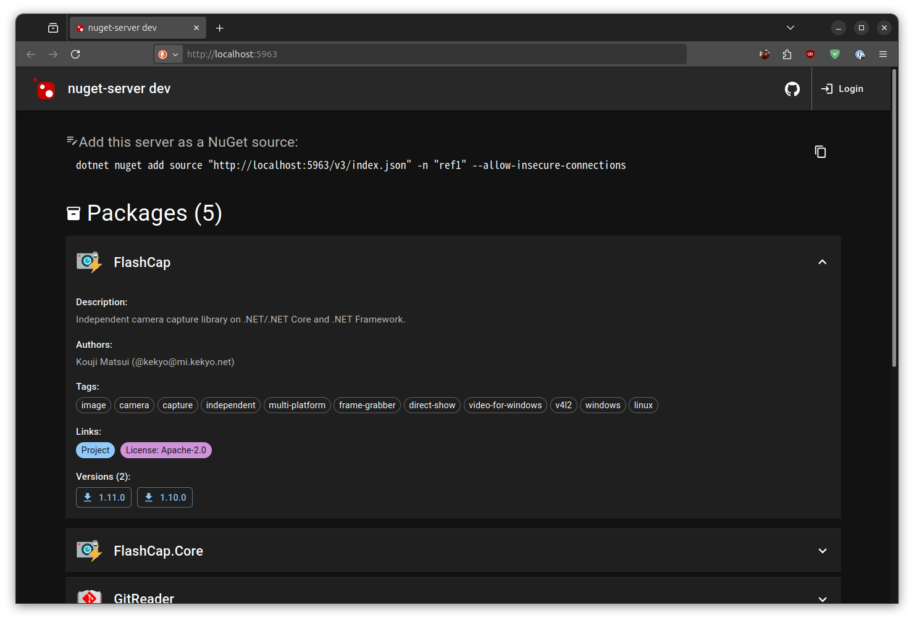

# nuget-server

Simple modenized NuGet server implementation on Node.js


[](https://www.repostatus.org/#wip)
[](https://opensource.org/licenses/MIT)

----

## What is this?

A simple NuGet server implementation built on Node.js that provides essential NuGet v3 API endpoints.

Compatible with `dotnet restore` and standard NuGet clients for package publishing, querying, and downloading.

A modern browser-based UI is also provided:

* You can refer to registered packages. You can check various package attributes.
* You can download packages by version.
* You can also publish (upload) packages.



### Key Features

* Easy setup, run NuGet server in 10 seconds!
* NuGet V3 API compatibility: Support for modern NuGet client operations
* No need database management: Store package file and nuspecs into filesystem directly, feel free any database managements
* Package publish: Flexible client to upload `.nupkg` files via `HTTP POST` using cURL and others
* Basic authentication: htpasswd-based authentication for publish and general access
* Proxy support: Configurable trusted proxy handling for proper URL resolution
* Docker image available

## Installation

```bash
npm install -g nuget-server
```

## Usage

```bash
# Start server on default port 5963
nuget-server

# Custom port
nuget-server --port 3000
```

----

## Documentation

[See the repository](https://github.com/kekyo/nuget-server)

## License

Under MIT.
